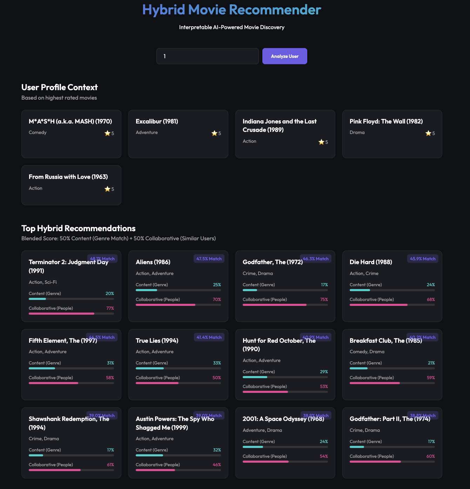

# CineMatch AI 🎬


A powerful, transparent movie recommendation system that combines the best of **Content-Based Filtering** and **Collaborative Filtering**. Designed to not just predict what you'll like, but **explain why**.

## 📸 Dashboard Demo



*The interface showcases transparent AI: users can see exactly how much growing genre interest (Content) vs. community trends (Collaborative) influenced each suggestion.*

## 🚀 Key Features

*   **⚡ Hybrid Intelligence**: Merges **TF-IDF Genre Embeddings** with **User-User Collaborative Filtering** for robust, personalized top-N recommendations.
*   **🔍 Explainable AI (XAI)**: A "Glass Box" approach. The dashboard visualizes the contribution of each model (Content vs. Collaborative) for every recommended movie.
*   **🧠 Cold Start Handling**: Content-based fallback ensures recommendations even with sparse user interaction.
*   **🎨 Premium UI**: A modern, dark-mode responsive dashboard built with Flask and Vanilla CSS.

## 🛠️ Tech Stack

*   **Language**: Python 3.12
*   **Data Processing**: Pandas, NumPy
*   **Machine Learning**: Scikit-Learn (TF-IDF Vectorization, Cosine Similarity)
*   **Backend**: Flask
*   **Frontend**: HTML5, CSS3 (Custom Design System), JavaScript (ES6)
*   **Dataset**: MovieLens Small (100k ratings, 9.7k movies)

## 🏗️ Architecture

1.  **Content-Based Engine**:
    *   Constructs a **Genre Matrix** using TF-IDF.
    *   Computes cosine similarity between a user's high-rated movies and the candidate pool.
    *   *Addresses: "I like Action movies, find me more."*

2.  **Collaborative Engine**:
    *   Constructs a **User-Item Matrix**.
    *   Finds k-nearest neighbors based on rating patterns.
    *   Predicts ratings using weighted averages from similar users.
    *   *Addresses: "People with taste like mine loved this."*

3.  **Hybrid Blender**:
    *   Normalizes scores from both engines.
    *   Computes a weighted final score (configurable alpha).

## 🏁 Getting Started

### Prerequisites
*   Python 3.10+
*   pip

### Installation

1.  **Clone the repository**
    ```bash
    git clone https://github.com/yourusername/hybrid-movie-recommender.git
    cd hybrid-movie-recommender
    ```

2.  **Install Dependencies**
    ```bash
    pip install -r requirements.txt
    ```

3.  **Run the Application**
    ```bash
    python app.py
    ```
    The application will automatically download the MovieLens dataset on the first run.

4.  **Explore**
    Open your browser to `http://127.0.0.1:3000`.
    *   Enter a **User ID** (e.g., `1`, `5`, or `10`) to analyze different user profiles.

## 📄 License

This project is licensed under the MIT License - see the [LICENSE](LICENSE) file for details.

---

**Tutorial Reference**: [Build a Hybrid Recommendation Engine](https://code2tutorial.com/tutorial/306061a9-f083-412d-b786-941257fd78b5/index.md)

*Built for the Advanced AI Recommendation Systems Project 2025.*
